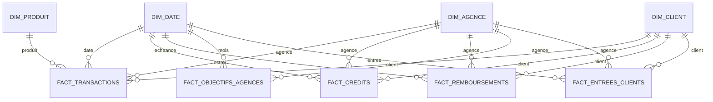

# Banque 360 

<p align="center">
  
</p>

# Projet Data Analyst SQL Server & Power BI


**Banque 360** est un projet personnel de Business Intelligence réalisé de bout en bout avec **SQL Server, Power Query, DAX et Power BI**.

Le projet simule le système décisionnel d’une banque régionale disposant de plusieurs agences. Il permet de suivre :

- l’activité transactionnelle ;
- la production de crédit ;
- les caractéristiques des clients ;
- les remboursements, retards et impayés ;
- les objectifs commerciaux ;
- la performance individuelle des agences.

L’objectif est de démontrer la réalisation complète d’un projet Data Analyst, depuis l’import et la fiabilisation des fichiers sources jusqu’à la création d’un rapport Power BI interactif.

> Toutes les données utilisées dans ce projet sont fictives. Des anomalies réalistes ont volontairement été intégrées afin de reproduire un véritable travail de contrôle, de nettoyage et de modélisation.

---

## Sommaire

1. [Aperçu du projet](#aperçu-du-projet)
2. [Contexte métier](#contexte-métier)
3. [Données utilisées](#données-utilisées)
4. [Architecture technique](#architecture-technique)
5. [Architecture SQL](#architecture-sql)
6. [Modèle analytique](#modèle-analytique)
7. [Power Query](#power-query)
8. [Modèle Power BI](#modèle-power-bi)
9. [Mesures DAX](#mesures-dax)
10. [Pages du rapport](#pages-du-rapport)
11. [Contrôles réalisés](#contrôles-réalisés)
12. [Reproduire le projet](#reproduire-le-projet)
13. [Choix techniques](#choix-techniques-défendables-en-entretien)
14. [Compétences démontrées](#compétences-démontrées)
15. [Limites et améliorations](#limites-et-pistes-damélioration)
16. [Auteur](#auteur)

---

# Aperçu du projet


## Résultat final

Le projet comprend :

- une base SQL Server nommée `Banque360` ;
- une architecture en couches `raw`, `staging`, `mart` et `reporting` ;
- 7 fichiers CSV importés et contrôlés ;
- 4 dimensions ;
- 5 tables de faits ;
- 9 tables analytiques importées dans Power BI ;
- 17 relations dans le modèle Power BI ;
- 15 relations actives et 2 relations de dates inactives ;
- plus de 45 mesures DAX ;
- 5 pages principales de rapport ;
- une page de contrôle ;
- une page de détail agence accessible par drill-through ;
- une documentation complète du projet.

---

# Contexte métier

La direction d’une banque régionale souhaite disposer d’un outil centralisé pour suivre l’activité et la performance de son réseau d’agences.

Le rapport doit notamment permettre de répondre aux questions suivantes :

- Quel est le niveau global d’activité transactionnelle ?
- Quels sont les montants de débits et de crédits ?
- Quels produits bancaires sont les plus utilisés ?
- Quelle est la production de crédit ?
- Comment évoluent les remboursements ?
- Quel est le niveau d’impayés et de retards ?
- Quels segments de clients sont les plus représentés ?
- Quelles agences atteignent leurs objectifs ?
- Quelles agences nécessitent une analyse approfondie ?

Le rapport final est destiné à plusieurs types d’utilisateurs :

- direction générale ;
- direction commerciale ;
- responsables du risque ;
- responsables régionaux ;
- directeurs d’agence.

---

# Données utilisées

Le projet repose sur 7 fichiers CSV.

| Fichier | Volume approximatif | Description |
|---|---:|---|
| `agences.csv` | 25 lignes | Informations sur les agences |
| `produits.csv` | 10 lignes | Catalogue des produits bancaires |
| `clients.csv` | 6 060 lignes | Informations clients et profils de risque |
| `transactions.csv` | 15 150 lignes | Transactions bancaires réalisées |
| `credits.csv` | 600 lignes | Crédits accordés aux clients |
| `remboursements.csv` | 18 899 lignes | Échéances et paiements des crédits |
| `objectifs_agences.csv` | 1 050 lignes | Objectifs mensuels par agence |

## Principaux champs analysés

### Agences

- identifiant de l’agence ;
- nom de l’agence ;
- ville ;
- département ;
- région ;
- date d’ouverture ;
- effectif ;
- catégorie d’agence.

### Clients

- identifiant client ;
- nom et prénom ;
- date de naissance ;
- date d’entrée ;
- segment ;
- profession ;
- revenu mensuel ;
- score de risque ;
- agence de rattachement ;
- statut du client.

### Transactions

- date de transaction ;
- client ;
- agence ;
- produit ;
- canal ;
- type de transaction ;
- montant débité ;
- montant crédité ;
- frais ;
- statut de la transaction.

### Crédits

- date d’octroi ;
- type de crédit ;
- montant initial ;
- taux annuel ;
- durée ;
- mensualité ;
- score de risque à l’octroi ;
- statut du crédit ;
- date de fin prévue.

### Remboursements

- date d’échéance ;
- date de paiement ;
- montant attendu ;
- montant payé ;
- statut du remboursement ;
- nombre de jours de retard ;
- indicateur d’impayé ;
- indicateur de retard.

### Objectifs

- objectif de revenu ;
- objectif de production de crédit ;
- objectif de nouveaux clients ;
- seuil de taux d’impayé.

---

# Anomalies traitées

Les fichiers sources contenaient volontairement plusieurs anomalies réalistes :

- doublons ;
- dates non convertibles ;
- dates impossibles ;
- valeurs manquantes ;
- montants incohérents ;
- revenus négatifs ou aberrants ;
- taux invalides ;
- différences de casse ;
- espaces inutiles ;
- accents incohérents ;
- libellés non homogènes ;
- références clients, agences ou produits inconnues ;
- crédits sans correspondance valide ;
- incohérences entre montants attendus et montants payés.

Une clé technique inconnue égale à `0` a été utilisée afin de conserver les lignes dont certaines références étaient absentes ou invalides.

---

# Architecture technique

## Environnement utilisé

- **macOS** comme système principal ;
- **Docker Desktop** pour exécuter SQL Server ;
- **SQL Server 2022** dans un conteneur Docker ;
- **Visual Studio Code** avec l’extension MS SQL ;
- **Windows 11 dans VMware Fusion** ;
- **Power BI Desktop** installé dans la machine virtuelle ;
- **GitHub** pour publier et documenter le projet.

## Flux technique

```text
Fichiers CSV
    ↓
SQL Server - raw
    ↓
SQL Server - staging
    ↓
SQL Server - mart
    ↓
Power Query
    ↓
Modèle Power BI
    ↓
Mesures DAX
    ↓
Rapport interactif
```

---

# Architecture SQL

La base SQL est organisée en quatre schémas.

## 1. Schéma `raw`

Le schéma `raw` conserve les données dans un format proche des fichiers sources.

Objectifs :

- préserver les données reçues ;
- assurer la traçabilité ;
- éviter toute perte d’information ;
- permettre de rejouer les traitements ;
- séparer la donnée brute de la donnée corrigée.

Les colonnes sont volontairement chargées avec des types permissifs avant nettoyage.

## 2. Schéma `staging`

Le schéma `staging` contient les données nettoyées et correctement typées.

Les traitements réalisés comprennent :

- conversion des dates ;
- conversion des montants ;
- normalisation des textes ;
- suppression des espaces inutiles ;
- traitement des valeurs manquantes ;
- détection des doublons ;
- déduplication ;
- contrôle des clés métier ;
- création d’indicateurs de qualité ;
- préparation des données pour le modèle analytique.

## 3. Schéma `mart`

Le schéma `mart` contient le modèle en étoile utilisé par Power BI.

Il sépare :

- les dimensions descriptives ;
- les faits mesurables ;
- les clés techniques ;
- les indicateurs utiles à l’analyse.

## 4. Schéma `reporting`

Le schéma `reporting` est prévu pour recevoir des vues, tables ou objets directement liés à la restitution et au suivi des contrôles.

---

# Modèle analytique

Le modèle final est un modèle en étoile composé de 4 dimensions et 5 tables de faits.



## Dimensions

| Table | Grain | Principaux axes d’analyse |
|---|---|---|
| `mart.dim_date` | Une ligne par date | Année, semestre, trimestre, mois, semaine, jour |
| `mart.dim_agence` | Une ligne par agence | Ville, département, région, catégorie, effectif |
| `mart.dim_client` | Une ligne par client | Segment, profession, revenu, risque, statut |
| `mart.dim_produit` | Une ligne par produit | Produit, famille, univers, complexité |

## Tables de faits

| Table | Grain | Principales mesures |
|---|---|---|
| `mart.fact_transactions` | Une ligne par transaction | Débit, crédit, montant signé, frais, rejet |
| `mart.fact_credits` | Une ligne par crédit | Montant initial, taux, durée, mensualité, risque |
| `mart.fact_remboursements` | Une ligne par échéance | Montant attendu, payé, non payé, retard, impayé |
| `mart.fact_objectifs_agences` | Une ligne par agence et par mois | Objectifs de revenu, crédit et acquisition |
| `mart.fact_entrees_clients` | Une ligne par entrée client | Nombre de nouveaux clients |

---

# Contrôles SQL

Des contrôles ont été réalisés à chaque étape du projet.

## Contrôles de structure

- présence de la base ;
- présence des schémas ;
- présence des tables ;
- présence des colonnes attendues ;
- vérification des types de données ;
- vérification des clés primaires ;
- vérification des clés étrangères ;
- vérification des index.

## Contrôles de qualité

- recherche des doublons ;
- détection des valeurs nulles ;
- détection des dates invalides ;
- contrôle des montants négatifs ;
- contrôle des taux ;
- contrôle des statuts ;
- contrôle des valeurs autorisées ;
- contrôle des références orphelines.

## Contrôles du modèle analytique

- unicité des dimensions ;
- contrôle du grain des tables de faits ;
- présence des membres inconnus ;
- contrôle de la clé inconnue `0` ;
- comparaison des volumes entre les couches ;
- conservation des montants ;
- intégrité des relations entre dimensions et faits.

Les scripts SQL sont numérotés afin d’imposer un ordre d’exécution clair et reproductible.

---

# Power Query

Power Query a été utilisé pour préparer la couche de présentation Power BI, sans remplacer les règles métier déjà traitées dans SQL.

## Transformations réalisées

- organisation des requêtes en groupes :
  - `01_Dimensions` ;
  - `02_Faits` ;
- vérification des types de données ;
- contrôle du profil des colonnes ;
- suppression des colonnes techniques inutiles ;
- nettoyage léger des libellés ;
- création de colonnes de présentation.

## Colonnes créées

### Libellé agence

Association de l’identifiant et du nom de l’agence afin d’obtenir un libellé lisible dans les graphiques.

Exemple :

```text
A001 - Bordeaux Centre
```

### Libellé produit

Association de l’identifiant et du nom du produit.

Exemple :

```text
P001 - Compte courant
```

### Tranche de revenu

Les clients ont été répartis en quatre catégories :

- moins de 1 500 € ;
- de 1 500 € à 2 499 € ;
- de 2 500 € à 3 999 € ;
- 4 000 € et plus.

### Niveau de risque

Les scores de risque ont été regroupés en trois niveaux :

- faible ;
- modéré ;
- élevé.

---

# Modèle Power BI

Le modèle Power BI est construit selon les principes d’un modèle en étoile.

## Principes appliqués

- relations de type `1 à plusieurs` ;
- filtrage à sens unique ;
- dimensions placées du côté `1` ;
- faits placés du côté `plusieurs` ;
- clés techniques masquées dans la vue Rapport ;
- table de dates dédiée ;
- tri chronologique des mois ;
- organisation claire des tables et mesures.

## Relations

Le modèle comprend :

- 17 relations au total ;
- 15 relations actives ;
- 2 relations inactives.

Les deux relations inactives concernent :

- la date de fin prévue des crédits ;
- la date réelle de paiement des remboursements.

Elles sont activées uniquement dans certaines mesures avec la fonction DAX `USERELATIONSHIP`.

## Table de dates

`mart.dim_date` a été marquée comme table de dates dans Power BI.

Les champs suivants ont été triés correctement :

- nom du jour ;
- nom du mois ;
- trimestre ;
- année-mois.

Cela permet d’éviter les tris alphabétiques incorrects dans les graphiques temporels.

---

# Mesures DAX

Les mesures sont regroupées dans une table dédiée nommée `_Mesures`.

Elles sont organisées dans cinq dossiers :

```text
01 - Transactions
02 - Crédits
03 - Remboursements
04 - Objectifs et clients
05 - Temps
```

## Transactions

Principales mesures :

- nombre de transactions ;
- montant des débits ;
- montant des crédits ;
- flux net ;
- frais totaux ;
- montant moyen d’une transaction ;
- nombre de transactions rejetées ;
- taux de rejet.

Exemple :

```DAX
Flux net =
[Montant crédits] - [Montant débits]
```

## Crédits

Principales mesures :

- nombre de crédits ;
- production de crédit ;
- montant moyen d’un crédit ;
- taux annuel moyen ;
- mensualité moyenne ;
- score de risque moyen ;
- production selon la date de fin prévue.

## Remboursements

Principales mesures :

- nombre d’échéances ;
- nombre d’impayés ;
- taux d’impayé ;
- nombre de retards ;
- taux de retard ;
- montant attendu ;
- montant payé ;
- montant non payé ;
- taux de recouvrement ;
- jours de retard moyens ;
- montant payé selon la date réelle de paiement.

Exemple :

```DAX
Taux impayé =
DIVIDE(
    [Nb impayés],
    [Nb échéances]
)
```

Exemple avec une relation inactive :

```DAX
Montant payé par date de paiement =
CALCULATE(
    [Montant payé],
    USERELATIONSHIP(
        'mart fact_remboursements'[date_paiement_key],
        'mart dim_date'[date_key]
    )
)
```

## Objectifs et clients

Principales mesures :

- nouveaux clients ;
- objectif nouveaux clients ;
- écart nouveaux clients ;
- taux de réalisation nouveaux clients ;
- objectif de production de crédit ;
- écart de production de crédit ;
- taux de réalisation production crédit ;
- revenu réalisé ;
- objectif de revenu ;
- écart de revenu ;
- taux de réalisation revenu ;
- nombre de clients distincts ;
- revenu mensuel moyen des clients ;
- score de risque moyen des clients.

## Temps

Principales mesures :

- valeur de l’année précédente ;
- évolution annuelle ;
- évolution en pourcentage ;
- comparaisons temporelles ;
- activation des rôles de dates secondaires.

---

# Pages du rapport

Le rapport comprend cinq pages principales et une page secondaire.

---

## 01 - Vue Direction

Cette page fournit une synthèse destinée à la direction.

### Indicateurs principaux

- revenu réalisé ;
- production de crédit ;
- nouveaux clients ;
- taux d’impayé ;
- taux de réalisation de la production de crédit.

### Visuels

- évolution mensuelle du revenu ;
- agences les plus performantes ;
- transactions par type ;
- taux de réalisation des objectifs.

---

## 02 - Performance commerciale

Cette page analyse l’activité bancaire et commerciale.

### Indicateurs principaux

- nombre de transactions ;
- frais totaux ;
- nombre de crédits ;
- production de crédit ;
- taux de rejet.

### Visuels

- évolution mensuelle des transactions ;
- comparaison des débits et crédits ;
- production de crédit par type ;
- répartition des transactions par canal.

---

## 03 - Analyse clients

Cette page étudie les profils et les comportements des clients.

### Indicateurs principaux

- nombre de clients distincts ;
- revenu mensuel moyen ;
- score de risque moyen ;
- nouveaux clients ;
- nombre de crédits.

### Visuels

- clients par segment ;
- clients par tranche de revenu ;
- clients par niveau de risque ;
- produits les plus utilisés.

Des couleurs spécifiques permettent de distinguer :

- les niveaux de risque ;
- les différentes tranches de revenu.

---

## 04 - Risque crédit

Cette page suit les remboursements et le risque de crédit.

### Indicateurs principaux

- nombre d’échéances ;
- nombre d’impayés ;
- taux d’impayé ;
- montant non payé ;
- taux de recouvrement.

### Visuels

- évolution mensuelle des impayés ;
- comparaison des montants attendus et payés ;
- agences présentant le plus de retards ;
- tableau des agences à surveiller.

Une mise en forme conditionnelle permet de faire ressortir :

- les taux d’impayé élevés ;
- les montants non payés ;
- les retards importants ;
- les faibles taux de recouvrement.

---

## 05 - Pilotage des agences

Cette page compare les performances réelles aux objectifs fixés.

### Indicateurs principaux

- revenu réalisé ;
- objectif de revenu ;
- taux de réalisation du revenu ;
- taux de réalisation de la production de crédit ;
- taux de réalisation des nouveaux clients.

### Visuels

- production de crédit réelle contre objectif ;
- nouveaux clients réels contre objectif ;
- écart de revenu par agence ;
- matrice de synthèse des performances.

La logique visuelle utilisée est la suivante :

- bleu : réalisé ;
- doré : objectif ;
- vert : objectif atteint ;
- orange : vigilance ;
- rouge : objectif non atteint.

---

## Détail agence

La page `Détail agence` est accessible par drill-through depuis la page de pilotage.

Elle permet d’analyser individuellement une agence sélectionnée.

### Éléments affichés

- revenu réalisé ;
- production de crédit ;
- nouveaux clients ;
- taux d’impayé ;
- taux de réalisation du revenu ;
- évolution du revenu ;
- production de crédit face à l’objectif ;
- nouveaux clients face à l’objectif ;
- indicateurs de risque.

Un bouton permet de revenir à la page précédente tout en conservant le contexte de navigation.

Cette page est masquée dans la navigation principale du rapport.

---

# Design du rapport

Une charte graphique cohérente a été utilisée sur l’ensemble des pages.

## Principes

- bandeau bleu nuit ;
- fond bleu très clair ;
- cartes blanches ;
- bordures discrètes ;
- coins arrondis ;
- titres homogènes ;
- alignement régulier des visuels ;
- couleurs fonctionnelles plutôt que décoratives.

## Signification des couleurs

- bleu : activité ou réalisé ;
- doré : objectif ;
- vert : résultat satisfaisant ;
- orange : situation intermédiaire ;
- rouge : risque, retard ou objectif non atteint ;
- gris : valeur inconnue ou secondaire.

---

# Interactivité

Le rapport intègre plusieurs fonctionnalités interactives :

- filtres par année ;
- filtres par mois ;
- filtres par agence ;
- filtres par catégorie d’agence ;
- filtres par segment client ;
- filtres par tranche de revenu ;
- filtres par niveau de risque ;
- filtres par type de crédit ;
- filtres par statut de remboursement ;
- interactions entre les graphiques ;
- info-bulles enrichies ;
- mise en forme conditionnelle ;
- drill-through vers le détail d’une agence ;
- bouton de retour ;
- navigation entre les pages.

---

# Contrôles réalisés

## Contrôles SQL

- validation des volumes ;
- contrôle des clés ;
- contrôle des références orphelines ;
- contrôle des doublons ;
- contrôle des montants ;
- contrôle des dates ;
- contrôle du grain des tables ;
- contrôle de la conservation des données.

## Contrôles Power BI

- vérification des relations ;
- vérification des cardinalités ;
- vérification du sens de filtrage ;
- vérification des relations inactives ;
- vérification des tris ;
- contrôle des formats ;
- comparaison des mesures avec les résultats SQL ;
- vérification des filtres ;
- contrôle des valeurs inconnues ;
- test des interactions ;
- test du drill-through ;
- test du bouton de retour.

---

# Reproduire le projet

## Prérequis

- Docker Desktop ;
- SQL Server 2022 ;
- Visual Studio Code ;
- extension MS SQL pour VS Code ;
- Power BI Desktop ;
- Git ;
- Git LFS si le fichier `.pbix` est volumineux.

## Étapes

1. Cloner le dépôt.

```bash
git clone https://github.com/benjaminblt/banque360-sql-powerbi.git
```

2. Ouvrir le dossier du projet.

```bash
cd banque360-sql-powerbi
```

3. Démarrer SQL Server dans Docker.

4. Copier les fichiers CSV dans le répertoire utilisé pour l’import SQL.

5. Exécuter les scripts SQL dans leur ordre numérique.

6. Vérifier que les contrôles finaux sont validés.

7. Démarrer Power BI Desktop.

8. Se connecter à SQL Server.

9. Importer les 9 tables du schéma `mart`.

10. Appliquer les transformations Power Query.

11. Vérifier les relations du modèle.

12. Vérifier ou recréer les mesures DAX.

13. Ouvrir les différentes pages du rapport.

14. Tester les filtres, interactions et pages de drill-through.

---

# Sécurité

Les éléments suivants ne doivent jamais être publiés :

- mot de passe SQL Server ;
- fichier `.env` ;
- chaîne de connexion contenant un mot de passe ;
- adresse IP privée inutile ;
- fichier contenant des données personnelles réelles ;
- sauvegarde de base contenant des informations sensibles.

Les données présentes dans ce dépôt sont exclusivement fictives.

---

# Choix techniques

## Pourquoi conserver une couche `raw` ?

La couche `raw` permet de conserver une copie fidèle des fichiers sources. Elle améliore la traçabilité, facilite les contrôles et permet de rejouer les traitements sans modifier les données d’origine.

## Pourquoi utiliser une couche `staging` ?

La couche `staging` centralise le nettoyage, le typage, la déduplication et les contrôles de qualité avant la création du modèle analytique.

## Pourquoi utiliser un modèle en étoile ?

Le modèle en étoile :

- simplifie les relations ;
- améliore la lisibilité ;
- évite les ambiguïtés ;
- facilite les calculs DAX ;
- améliore les performances ;
- correspond aux bonnes pratiques de Business Intelligence.

## Pourquoi séparer SQL, Power Query et DAX ?

### SQL

Utilisé pour :

- importer ;
- nettoyer ;
- contrôler ;
- appliquer les règles métier ;
- construire le modèle analytique.

### Power Query

Utilisé pour :

- préparer la présentation ;
- créer certains libellés ;
- organiser les requêtes ;
- effectuer des transformations légères et visibles.

### DAX

Utilisé pour :

- créer des indicateurs dynamiques ;
- calculer des ratios ;
- comparer les résultats aux objectifs ;
- effectuer des analyses temporelles ;
- adapter les calculs au contexte des filtres.

## Pourquoi utiliser une clé inconnue `0` ?

Elle permet de conserver une ligne de fait même lorsqu’une référence est manquante ou invalide. La donnée n’est pas supprimée et peut rester visible dans les contrôles de qualité.

## Pourquoi certaines relations de date sont-elles inactives ?

Une même table de faits peut contenir plusieurs dates jouant des rôles différents.

Par exemple :

- date d’échéance ;
- date de paiement ;
- date d’octroi ;
- date de fin prévue.

Une seule relation peut être active par défaut. Les autres sont activées ponctuellement dans les mesures avec `USERELATIONSHIP`.

## Pourquoi utiliser une page de drill-through ?

La page de drill-through permet de passer d’une vue globale du réseau à une analyse détaillée d’une agence, tout en conservant le contexte de sélection.

---

# Compétences démontrées

## SQL

- création d’une base ;
- création de schémas ;
- création de tables ;
- import de CSV ;
- typage des données ;
- nettoyage ;
- déduplication ;
- jointures ;
- contrôles de qualité ;
- création de dimensions ;
- création de tables de faits ;
- clés primaires et étrangères ;
- index ;
- modèle en étoile.

## Power BI

- connexion à SQL Server ;
- Power Query ;
- modèle de données ;
- relations ;
- table de dates ;
- tri des colonnes ;
- mesures DAX ;
- intelligence temporelle ;
- visualisations ;
- filtres ;
- info-bulles ;
- mise en forme conditionnelle ;
- navigation ;
- drill-through ;
- création d’un rapport décisionnel.

## Analyse métier

- analyse commerciale ;
- analyse client ;
- suivi du risque ;
- suivi des crédits ;
- suivi des remboursements ;
- comparaison réel contre objectif ;
- analyse de performance par agence.

## Gestion de projet

- organisation des fichiers ;
- documentation ;
- reproductibilité ;
- contrôle des résultats ;
- construction d’un portfolio ;
- présentation des choix techniques.

---

# Limites et pistes d’amélioration

Le projet présente certaines limites assumées :

- les données sont fictives ;
- le volume reste inférieur à celui d’une banque réelle ;
- le projet est exécuté localement ;
- aucune actualisation planifiée n’est configurée ;
- le revenu est approché à partir des frais de transaction disponibles ;
- aucune gestion avancée des droits utilisateurs n’a été mise en place.

## Améliorations possibles

- publication dans Power BI Service ;
- actualisation planifiée ;
- mise en place de Row-Level Security ;
- automatisation des imports ;
- orchestration avec Airflow ou Azure Data Factory ;
- tests SQL automatisés ;
- intégration continue ;
- déploiement cloud ;
- ajout d’indicateurs de rentabilité ;
- analyse prédictive du risque ;
- prédiction de l’attrition client ;
- documentation automatique du modèle.

# Auteur

**Benjamin Baillet**

Data Analyst junior spécialisé en :

- SQL ;
- Power BI ;
- Excel ;
- Python ;
- R ;
- analyse de données ;
- Business Intelligence.
